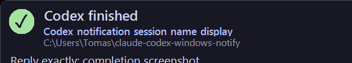
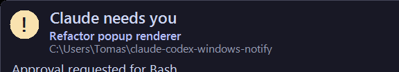
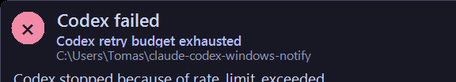

# Windows Notifications for Claude, Codex & OpenCode

Native Windows notifications for [Claude Code](https://code.claude.com/), [Codex CLI](https://github.com/openai/codex), and [OpenCode](https://opencode.ai/), with exact-pane return for WezTerm.

When any agent finishes a turn or needs approval, you get a compact popup with sound, the session name and working directory, and a response preview. Clicking it returns you to the session that produced it: the exact pane in WezTerm, or the window of the app hosting the terminal everywhere else, including an integrated terminal inside VS Code or Cursor.

All three agents are first-class. One renderer serves all, and each is wired through its own native hook mechanism: a plugin for Codex, the settings file for Claude Code, and a plugin for OpenCode.

## Screenshots

### Completion



Claude Code and OpenCode completion popups use the same renderer.

### Approval



Codex and OpenCode approval popups use the same renderer.

### Failure



Three agents, one popup. Each carries the session name, working directory, and a preview of the response or error.

## Features

- Completion and approval-request notifications from Codex, Claude Code, and OpenCode lifecycle hooks
- Final-response preview using each agent's supported `last_assistant_message` field
- Session name on the popup, read from each agent's own session records
- Click-to-return: the exact pane in WezTerm, the host app's window elsewhere
- UTF-8 previews for punctuation, non-Latin scripts, and emoji
- Distinct sound and color for completion versus approval versus failure
- Popup on the originating session's monitor
- Twenty-second timeout that pauses while hovered
- No PowerShell modules or other runtime dependencies

## Requirements

- Windows 10 or 11
- Windows PowerShell 5.1 in Full Language mode
- One or more of:
  - Codex CLI with plugin and lifecycle-hook support
  - Claude Code 2.1.198 or newer, for the full notification event set
  - OpenCode 1.18.0 or newer, with plugin support
- Optional: native Windows WezTerm with `wezterm cli list`, `list-clients`, and `activate-pane` for exact-pane return

The agent must run natively on Windows with an interactive desktop. WSL and SSH-domain compatibility has not been verified.

### Terminal support

The notification is ordinary Windows UI, so it does not depend on terminal-native notification support. It works in Windows Terminal, Alacritty, other native Windows terminals, and terminals embedded in another app such as VS Code or Cursor.

Click-to-return comes in two levels. When `WEZTERM_PANE` is available, WezTerm's supported CLI locates the originating monitor and returns to the exact pane. Everywhere else, the notification focuses the window of the app hosting the terminal, because no other terminal exposes a verified exact-pane activation path and the implementation does not guess. See [the terminal support research](research/terminal-support.md) for the primary-source compatibility matrix.

## Install

Install for any agent, or all three. They are independent and can be used together.

### Codex

```powershell
codex plugin marketplace add Tomauskasz/claude-codex-windows-notify
codex plugin add claude-codex-windows-notify@claude-codex-windows-notify
```

Start a new Codex session, review the two bundled hooks, and trust them when prompted. The plugin registers:

- `Stop` for completed turns
- `PermissionRequest` for approval prompts

No manual `config.toml` changes are required.

### Claude Code

Claude Code has no plugin hook mechanism, so it is configured through `%USERPROFILE%\.claude\settings.json`. Merge the hook block from [Install for Claude Code](docs/claude-code.md) into that file. It registers four events:

- `Stop` for completed turns
- `PermissionRequest` for approval prompts and `AskUserQuestion`
- `Notification` for elicitation dialogs and background agents
- `StopFailure` for API errors such as rate limits

### OpenCode

OpenCode uses a plugin system. Copy the bundled plugin directory:

```powershell
Copy-Item -Recurse .\plugins\claude-codex-windows-notify `
  "$env:USERPROFILE\.config\opencode\plugins\claude-codex-windows-notify"
```

The plugin emits one completion notification for root `session.idle`. Child/subagent sessions are ignored via `parentID` from `session.updated`. It ignores `session.error`. Repeated idle events for the same session are deduplicated over ten seconds.

Add the plugin to `%USERPROFILE%\.config\opencode\opencode.json`:

```json
{
  "plugin": [
    "C:\\Users\\[USERNAME]\\.config\\opencode\\plugins\\claude-codex-windows-notify\\notification.js"
  ]
}
```

Restart OpenCode after install or update. Copy the full plugin directory so `scripts/notify.ps1` sits next to `notification.js`.

## Update

Codex:

```powershell
codex plugin marketplace upgrade claude-codex-windows-notify
```

Start a new Codex session after upgrading.

Claude Code reads the script from your clone on every hook invocation, so `git pull` is enough. Restart a running session only if the hook list itself changed.

OpenCode reads the plugin on startup. Restart OpenCode after updating the plugin file.

## Uninstall

Codex:

```powershell
codex plugin remove claude-codex-windows-notify@claude-codex-windows-notify
codex plugin marketplace remove claude-codex-windows-notify
```

For Claude Code, remove the hook entries you added to `settings.json`.

For OpenCode, remove the plugin entry from `opencode.json` and delete the `notification.js` file.

## How it works

The hook decodes stdin as UTF-8, accepts an optional UTF-8 BOM, synchronously validates the JSON payload against the event it was registered for, and detects whether `WEZTERM_PANE` is available. For a WezTerm session it also captures the WezTerm executable and mux socket. It then starts a detached PowerShell worker with a bounded notification payload so the lifecycle hook returns immediately. Codex, Claude Code, and OpenCode reach the same renderer; only the `-Event` and `-ProductName` arguments differ.

The worker renders a WinForms popup. In WezTerm, clicking it uses the JSON CLI to activate the pane, resolves the owning GUI process, ignores owned, tool, and untitled helper windows, and focuses the matching switchable window. Activation never changes the geometry of a window that is already on screen, so a normal, maximized, or snapped window is left exactly where it is. A minimized window is the one exception: it is restored, because it has no on-screen geometry to preserve and activation alone cannot raise it. Ambiguous window matches fail closed and produce `%TEMP%\claude-codex-windows-notify.log` plus an error dialog.

Outside WezTerm the hook records the process ancestry from itself towards the terminal host, and clicking the popup focuses the window of the app that hosts the session. This covers terminals embedded in another app: an integrated terminal in VS Code or Cursor hangs off a windowless pty-host process, so the first ancestor that owns a switchable window is the editor itself. A detached Claude background session can outlive that ancestry, so the hook also records the inherited VS Code-family marker and uses it only when no ancestor owns a window. The walk validates each hop against the parent's creation time, because Windows recycles process IDs, and stops before session managers and the shell so a stale ID cannot focus a stranger's window. When one host owns several windows, the deepest folder names of the session's working directory are matched against the window titles; a match that is not unique fails closed rather than guessing. Focus uses the same activation path as WezTerm, so the same geometry rule applies here too.

The popup uses same label as each agent's session picker. Codex reads the latest `thread_name` from
`$env:CODEX_HOME\session_index.jsonl` (default `~\.codex`) or first persisted user message from its session rollout.
Claude Code reads its live session name, then the latest explicit transcript name or AI-generated transcript title under
`$env:CLAUDE_CONFIG_DIR` (default `~\.claude`). OpenCode uses its `session.updated` title event. Missing or unreadable
metadata falls back to the session ID. The implementation does not read either agent's SQLite database.

## Privacy

The response preview, session name, and working directory are rendered locally on screen. The plugin makes no network requests and uploads nothing. Anyone who can see your desktop may see notification content.

## Limitations

- Windows may refuse foreground activation in some focus-stealing-policy scenarios; the plugin reports that failure instead of silently claiming success.
- If the originating pane or window has closed, click-to-focus cannot succeed.
- Exact-pane focus is available only in WezTerm. VS Code, Cursor, and Windows Terminal expose no way to focus one terminal tab or split, so clicking a notification from those hosts raises the window and no more.
- One editor instance shares a single pty host across all of its windows, so which window holds the terminal cannot be read from process ancestry. Window-title matching covers the usual case of a workspace named after its folder, and a custom `window.title` or two workspaces with the same folder name will read as ambiguous.
- Sessions reached over SSH or a remote multiplexer cannot be focused, because the host window is not on this machine.
- WSL and SSH-domain compatibility is not verified.
- Concurrent notifications can overlap.
- Popup rendering and focus behavior require an interactive Windows desktop and therefore are not exercised in GitHub Actions.

## Development

Run the deterministic hook and payload tests:

```powershell
.\tests\run-tests.ps1
```

Validate the plugin manifest with Codex's plugin-creator validator:

```powershell
python "$env:USERPROFILE\.codex\skills\.system\plugin-creator\scripts\validate_plugin.py" `
  ".\plugins\claude-codex-windows-notify"
```

The tests cover WezTerm and generic-terminal payloads, Codex and Claude Code event contracts, session-name resolution and its fallback to the session ID for both agents, process-ancestry capture and its boundary, unique window resolution for detached sessions, WezTerm helper-window filtering, window-title segment derivation, raw UTF-8 input and exact Unicode preservation, the documented completion-message field, invalid input, hook mismatches, Unicode-safe response limits, extended UNC paths, plugin-root command resolution, the geometry invariant that activation must only ever restore a minimized window, and forbidden internal agent dependencies.

Popup rendering, click-to-focus, and window activation need an interactive desktop, so they are verified manually rather than in the suite.

## License

MIT
